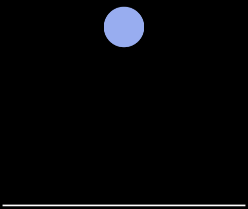

# freeFall
## JavaScript实现自由落体
>利用Canvas画圆球、地面

>物理知识实现下落反弹的位移计算

## 实现分析
利用Canvas画圆球、地面；

### 下落过程
物理知识回顾，物体下落过程（不计损耗）由重力势能转换成动能

重力势能 Ep = mgh

动能 　　Ek = (1/2)mv^2

速度右0增加至gt

此间需要计算浏览器每次渲染的圆球y坐标

y = (1/2)gt^2

### 反弹过程
动能转化成重力势能

速度是逐渐减少直至为0

本打算设置 y = (1/2)g(t-t1)^2，t1为下落或者反弹消耗的时长

但是实际呈现的效果却不尽人意，应该是反弹位移计算有误，经反复思考无果（若哪位大拿有更好的实现方式欢迎评论告知）

所以决定将下落过程的位移保存在一个数组里，待反弹时再逐一取出赋值
